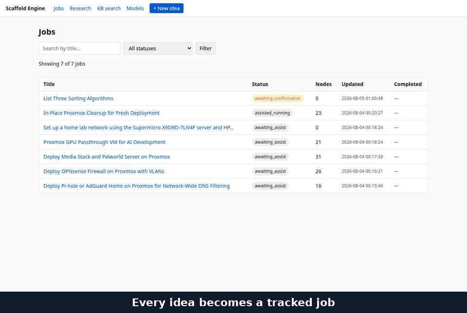

# Scaffold Engine

[](https://github.com/LocketKeyLLC/scaffold-engine/actions/workflows/ci.yml)
[](./LICENSE)
[](./CHANGELOG.md)

A self-hosted DAG orchestration engine for multi-step LLM workflows. You give it an idea; it researches the topic, plans an execution graph, runs each step with verification, and hands back a compiled output. Everything runs locally on your hardware (Ollama for inference, Milvus for vector search, Postgres for state, SearXNG for web search) — no cloud calls unless you opt in.



This README is a **complete from-zero walkthrough**: every command, what it does, what you'll see, and what to do if it goes wrong. If you finish reading this end-to-end you should be able to clone the repo on a fresh machine and have your first compiled output ~45 minutes later.

For details beyond setup-and-first-run, read:

- **[USER_GUIDE.md](./USER_GUIDE.md)** — every command, organized by what you're trying to do (start a project, do research, run a manual walkthrough, schedule something recurring, …).
- **[OVERVIEW.md](./OVERVIEW.md)** — comprehensive technical reference. Architecture, every module, every public function, the full database schema, configuration, the TOON data format, the logging catalog, known issues, performance benchmarks, and a glossary.
- **[CHANGELOG.md](./CHANGELOG.md)** — release-level history. **[CONTRIBUTING.md](./CONTRIBUTING.md)** — dev setup and PR ground rules. **[SECURITY.md](./SECURITY.md)** — how to report vulnerabilities.

---

## What scaffold-engine actually does

You type an idea. The system:

1. **Refines** the idea into a structured brief (problem statement, success criteria, constraints).
2. **Assesses feasibility** and **halts**. You read the plan and approve it. This is the only deliberate pause point.
3. **Researches** the topic — runs SearXNG searches, fetches pages, distills facts into a knowledge base.
4. **Generates a DAG** of execution nodes (research / decision / action / validation / output). Each node has a tool assigned (LLM, code generation, web search, RAG retrieval).
5. **Executes** each node in dependency order. Output of upstream nodes becomes context for downstream ones. A verifier checks each result; failed nodes auto-retry up to three times.
6. **Compiles** the final output from the leaf nodes and stores it.

A typical run on CPU-only hardware takes 30–60 minutes for a non-trivial topic. Most of that time is the LLM thinking; you can watch progress stream in real time.

---

## Before you start — what you need

Before running the install steps below, make sure you have:

| Requirement | Why | How to verify |
|---|---|---|
| Docker + Docker Compose | The orchestrator, database, vector store, search engine, and chat UI all run as containers. | `docker --version` and `docker compose version` should both work. |
| Ollama installed on your **host** (not in a container) | Runs the local LLMs. The orchestrator reaches it through the docker bridge gateway. | `ollama list` should respond. Install from <https://ollama.ai>. |
| ~30 GB free disk | Models alone are ~25 GB; the vector store and Postgres add a few more. | `df -h .` |
| ~16 GB RAM | The always-on containers are memory-capped at ~14.75 GiB combined (orchestrator 6g, Milvus 3g, Redis 2.5g, the rest smaller); Ollama loads models on demand on the host. | `free -h` (Linux) / Activity Monitor (mac) |
| `git` and a UTF-8 terminal | For cloning and running commands. | `git --version` |

If you're on Pop!_OS / Ubuntu and Docker is fresh, also run `sudo usermod -aG docker $USER` and log out + back in so you can run `docker` without `sudo`.

---

## First-time install

The quickstart is two commands:

```bash
git clone https://github.com/LocketKeyLLC/scaffold-engine.git && cd scaffold-engine
make bootstrap
```

`make bootstrap` does everything the manual path below does: checks Docker/Ollama, offers to pull the default local models, creates the network/volumes, seeds the SearXNG config, asks whether you want the optional Open WebUI chat front-end, generates a `.env` with strong secrets, brings up the stack, and finishes with a full `make doctor` health audit. When it's done, open **http://localhost:8000/ui**, sign in with the `SCAFFOLD_API_KEY` it generated (it's in your `.env`), and the first-run **"Connect your models" wizard** takes it from there.

The rest of this section is the same install done **manually**, step by step — read it to understand what bootstrap did, or if you prefer explicit control.

### 1. Clone the repo

```bash
git clone https://github.com/LocketKeyLLC/scaffold-engine.git
cd scaffold-engine
```

You should see `app/`, `sdk/`, `cli/`, `pipelines/`, `db/`, `docker-compose.yml`, and a few other directories.

### 2. Create your `.env`

```bash
cp .env.example .env
```

Now open `.env` in your editor and set the **required** values at the top — the file walks you through each one (`WEBUI_SECRET_KEY`/`OPENWEBUI_PIPELINES_KEY` matter only if you enable the `owui` profile). The most important is `SCAFFOLD_API_KEY`, which gates every authenticated request to the orchestrator. Generate one with `openssl rand -hex 32` if you don't have a preferred secret-generation flow.

> **What can go wrong:** if you skip this step and start the stack, `docker compose` will refuse to bring up the orchestrator (the compose file has `${SCAFFOLD_API_KEY:?...}` as a hard requirement). The error message tells you which variable is missing.

### 3. Pull the local models

```bash
ollama pull qwen3:4b qwen2.5:7b qwen2.5-coder:7b nomic-embed-text qwen3.5:latest
```

This downloads the five default local models (role-mapped: `qwen3:4b` routes/triages, `qwen2.5:7b` generates/verifies/extracts, `qwen2.5-coder:7b` codes, `qwen3.5:latest` is the escalation + fallback tier, `nomic-embed-text` embeds). Each is 1–8 GB except `nomic-embed-text` (~270 MB); on a typical home connection plan for ~10 minutes total. Ollama caches them in `~/.ollama/models`.

> **Embedder note:** the embedder is `nomic-embed-text` (137M params, 768-dim native, MRL-truncated to 512 to match Milvus). The embedding dimension is locked at 512, so the embedder is configured once at install and is not swapped per-request; changing it later means re-embedding the corpus (see USER_GUIDE.md "Embedder portability").

> **What can go wrong:**
> - "model not found" → Ollama isn't running. Start it: `ollama serve` (foreground) or check the systemd unit on Linux.
> - Slow download → Ollama shows download progress; if it stalls, Ctrl-C and retry. Resume is automatic.
> - You don't have to use all five. The system will tell you at request time which roles are missing models — see `make doctor` below, and the `/ui` wizard flags unpulled role tags.

### 4. Bring up the stack

```bash
docker compose up -d
```

This starts eight containers: orchestrator, Postgres, Milvus, Redis, SearXNG, and three simulation sidecars (ngspice, verilator, symbiyosys — see [Optional surfaces](#optional-surfaces)). First time takes ~3 minutes (image downloads + initial DB migration). Subsequent starts are ~15 seconds.

Optional services live behind [compose profiles](https://docs.docker.com/compose/how-tos/profiles/) — set `COMPOSE_PROFILES` in `.env` (comma-separated) before `docker compose up -d`:

| Profile | Adds | Why |
|---|---|---|
| `owui` | Open WebUI (`:3000`) + its pipelines container | The chat front-end. Optional since §17.821 — the `/ui` SPA is the native front door. |
| `sandbox` | `scaffold-coderunner` | Isolated code-execution sidecar. |
| `observability` | Phoenix (`:6006`) | OTel trace viewer. |

> **What you'll see:** `docker compose` prints a green checkmark per container as each becomes healthy. If any go red, check `docker compose logs <name>` for that container.

### 5. Verify everything is healthy

```bash
make doctor
```

This runs an end-to-end audit. The script opens with an 11-section banner listing every check that's about to run (`.env`, Docker network + volumes, Containers, Orchestrator `/health`, Ollama, OpenAI provider, API key sync across .env/container/bashrc/valves.json, Auth posture, Schema migrations, cold-backup mount guard, full key-surface sync) so you know what's being probed before output starts scrolling. Expected output is the banner followed by a short list of subsystem checks, all `PASS`. The script also confirms your `.env` API key matches what the running containers are using and warns if they've drifted. Pass `--explain` (or run `make doctor-explain`) for a one-line description under each section.

```bash
curl -H "X-API-Key: $SCAFFOLD_API_KEY" http://localhost:8000/health
```

Returns a JSON object with `status: "healthy"` and per-dependency latency numbers. Postgres, Milvus, Redis, and Ollama should all show `up`.

> **What can go wrong:**
> - `Cannot reach orchestrator` → run `docker ps` to confirm all containers are up. Check `docker logs scaffold-orchestrator` for startup errors.
> - `ollama: down` → host Ollama isn't running, or the bridge gateway isn't reaching it. Confirm `ollama list` works on the host. If yes, check that `OLLAMA_BASE_URL` in `.env` points at the bridge gateway (default `http://172.18.0.1:11434` for Pop!_OS / native Docker).

### 6. Open the UI

The native operator SPA is the front door:

```bash
open http://localhost:8000/ui
```

Paste your `SCAFFOLD_API_KEY` at the login screen. From there the first-run "Connect your models" wizard walks you through pointing every model role at your Ollama daemon.

**Optional — Open WebUI chat.** If you enabled the `owui` profile (`COMPOSE_PROFILES=owui` in `.env`):

```bash
open http://localhost:3000
```

Open WebUI loads. Create the local admin account (it's not federated; the credentials only exist on your machine). At the top of the chat window, the model selector should show **scaffold_router** (or any name containing "scaffold") — that's the OWUI pipeline that talks to the orchestrator.

If `scaffold_router` doesn't appear in the model dropdown, the OWUI pipelines container hasn't picked up the pipeline files yet. Run `docker restart open-webui-pipelines` and refresh the page.

---

## Your first project — end to end

Now type your first idea into the chat. For your first run, pick something small that the system can complete in 20–30 minutes:

> Build a Python script that lists files in a directory sorted by size, with human-readable file sizes.

Press Enter. The system replies with refined-brief output and a job ID. Copy the job ID (a UUID like `481010cd-9542-4b27-9af3-7c80f468af89`).

Then approve it:

```
/confirm 481010cd-9542-4b27-9af3-7c80f468af89
```

The system runs research → DAG generation, then **asks how you want to run the plan** (with a recommendation):

- `/execute <job_id>` — **autonomous**: the engine runs every step itself (best for writing / code / research).
- `/assist <job_id>` — **assisted**: you run each step on your own machine, the engine guides and verifies (best for plans with hands-on / shell steps).

For this first run, pick `/execute`. It streams progress events to your chat; when it's done you'll see the final compiled script.

Check progress at any time with:

```
/results 481010cd-9542-4b27-9af3-7c80f468af89
```

…or just type **`/here`** to see everything in progress and your next step — no job ID needed. `/resume` jumps straight back into whatever you were doing.

> **Don't memorize IDs.** `/here`, `/next`, and `/resume` all work off the most recent job, so you rarely need to paste a UUID.

> **What can go wrong on your first run:**
> - Phase 2 (research) can take 10–25 minutes on CPU. The chat shows a visible "⏳ Phase 2 — researching + ingesting… (Xm YYs elapsed)" marker every ~2 minutes. For sub-step detail, tail the orchestrator (`docker logs -f scaffold-orchestrator`) — it logs each SearXNG query, distillation batch, and Milvus ingest as it happens.
> - If the system says `awaiting_confirmation` and won't move forward, you skipped step 6 (the `/confirm` command).
> - If a DAG node fails after three auto-retries, it goes to `blocked`. Run `/results <job_id>` for a copy-pasteable retry or skip command.

> **Guided by default.** The chat exposes a small core set — `/go`, `/idea`, `/confirm`, `/execute`, `/assist`, `/here`, `/next`, `/resume`, `/results`, `/cancel`, `/help`. The ~45 power commands (`/research`, `/jobs`, `/model`, `/schedule`, `/rag`, …) are one toggle away: type **`/advanced on`** (it sticks across restarts). `/help` lists the core; `/help` after `/advanced on` lists everything. Full reference: [USER_GUIDE.md](./USER_GUIDE.md).

---

## Day-to-day operations

Once the stack is running, these are the commands you'll use most often:

| What you want | Command | What it does |
|---|---|---|
| See live system health | `make health` | Hits `/health`, prints subsystem latencies. |
| Tail logs in real time | `make logs-follow` | `docker logs -f scaffold-orchestrator`, scroll-back included. |
| List active jobs | `make status` | Hits `/status`, prints a counts table + recent jobs. |
| Reap stale jobs | `make clean` | Triggers the cleanup endpoint; safe to run anytime. |
| Apply DB migrations | `make migrate` | The lifespan auto-applies migrations on startup; this is for force-runs. |
| Re-run health audit | `make doctor` | Full pre-flight, with explanations. |
| Show all targets | `make help` | Self-documenting Makefile; every target has a one-line description. |

Bash completion for `make` targets: `source scripts/make-completion.bash` to enable `make st<TAB>` → `status` / `status-raw` for the current shell, or append the `source` line to `~/.bashrc` for it to stick across sessions.

Open WebUI is for chat-driven workflows. The Python SDK and `scaffold` CLI exist for programmatic access — see [USER_GUIDE.md](./USER_GUIDE.md) for examples of both.

---

## Multi-user setup

By default the engine is **single-user**: the one `SCAFFOLD_API_KEY` is the only accepted credential, and it has full access to everything. That's the right mode for a personal box. If you want several people (or several machines) sharing one deployment, each seeing only their own work, turn on **multi-user mode**.

### 1. Enable the mode

Flip the flag in `.env` (it ships as `MULTI_USER_ENABLED=false`) and restart the orchestrator:

```bash
sed -i 's/^MULTI_USER_ENABLED=.*/MULTI_USER_ENABLED=true/' .env
docker compose up -d
```

`SCAFFOLD_API_KEY` stays valid — it becomes the **admin** key (sees and manages every user's jobs). Additional users get their own **scoped keys**, minted below.

### 2. Mint a key per user

```bash
make key-add LABEL="alice laptop" OWNER=alice ROLE=user      # a normal user
make key-add LABEL="ops box"      OWNER=carol ROLE=admin     # a second admin
```

The raw key (`sk-scaffold-…`) is printed **once** and never recoverable — only its SHA-256 hash is stored. Hand it to that person as their `X-API-Key` header value.

Two things to understand about the identity model:

- **`OWNER` is the user.** Two keys minted with the same `OWNER` are the *same* user — they share visibility. So `alice laptop` and `alice desktop` (both `OWNER=alice`) both see alice's jobs. Omit `OWNER` and the key is isolated to itself.
- **`ROLE`** is `user` (default — sees and manages only their own jobs) or `admin` (full access, like the master key). `ROLE` defaults to the least-privileged `user` if omitted.

### 3. What each user sees

Once multi-user is on, every job (and research session, schedule, assist session, design job, artifact) is stamped with its creator's owner. Enforcement is automatic across the whole API:

| Actor | `GET /jobs`, `/status`, `/logs`, … | Another user's job | `POST /jobs/cleanup` |
|---|---|---|---|
| `user` (alice) | only alice's own | **404** (indistinguishable from "doesn't exist") | **403** (admin-only) |
| `admin` / master key | everything | 200 | 200 |

Cross-user access returns **404, not 403** on purpose — a user can't even learn that someone else's job exists.

### Managing keys

```bash
make key-list                          # id, label, owner, role, status
make key-list ALL=1                    # include revoked keys
make key-revoke ID=3                   # revoke by id (or LABEL="alice laptop")
```

Revocation is immediate — the next request with that key gets a 401.

> **Admin-only surfaces.** The OpenAI-compatible `/v1` API, the MCP server at `/mcp`, and the server-rendered `/web` console accept only the **master admin key** and are not per-user. They reach the pipeline through an internal loopback that authenticates as the master key, so they operate with admin visibility by design. Per-user access is the JSON API and the `/ui` SPA (both send `X-API-Key` and are fully scoped). In a multi-user deployment, keep `/web` network-restricted (it's an operator console that shows all jobs).

> **What can go wrong:**
> - Minted a key but the user still gets 401 → confirm `MULTI_USER_ENABLED=true` is actually set in the *running* container: `docker exec scaffold-orchestrator printenv MULTI_USER_ENABLED`. It's read at startup, so a `.env` edit needs `docker compose up -d`.
> - A user sees no jobs after creating one → check the key's `ROLE`/`OWNER` with `make key-list`; jobs created *before* multi-user was enabled have no owner and are visible only to admins.
> - Turning the flag back off reverts to single-user (master key only) with no data change — the `owner`/`role` columns simply stop being consulted.

---

## Updating

Pull the latest code and rebuild:

```bash
git pull
docker compose up -d --build
```

Migrations run automatically at startup. If a migration fails (rare), the orchestrator container will report it in its logs and refuse to start; review the error and check OVERVIEW.md §15 for migration policy.

For embedder model changes (rarely needed), see USER_GUIDE.md "Embedder portability" — switching embedders requires re-embedding the corpus, and the docs walk through that with `make reindex`.

---

## Backup & restore

```bash
make backup                    # → .backups/<utc-timestamp>/
make restore                   # newest backup, interactive confirm
make restore BACKUP=<ts> YES=1 # scripted restore of a specific backup
```

`make backup` captures **all** engine state: a `pg_dump` of Postgres (jobs, DAG nodes, research sessions, schedules, API keys, model overrides…), a JSONL export of the entire Milvus `toon_v2` knowledge corpus **including dense vectors** (no re-embedding on restore), and a `manifest.json` of row/entity counts that `make restore` verifies against. Backups are plain files under `.backups/` — copy them off-box on whatever schedule you like (a weekly cron of `make backup` + rsync is plenty).

Take a backup before any upgrade, `docker compose down`, or volume surgery.

## Tearing it down

```bash
docker compose restart   # safe way to bounce the stack
```

> **⚠ `docker compose down` does NOT reliably preserve the Milvus knowledge corpus.** Postgres data survives `down` on its named volume, but the Milvus collection has been observed (twice) to come back **empty** after a `down`/`up` cycle — segments orphan despite the persistent volume. Until that's root-caused: use `docker compose restart` for routine bounces, and run `make backup` first if you must `down` (then `make restore` brings the corpus back, vectors included).

```bash
docker compose down -v
```

Stops containers AND deletes volumes. **This loses every job, knowledge base entry, and schedule** — use with care (and only after `make backup`).

```bash
git clean -fdx
```

Removes everything not tracked by git (your `.env`, build caches, etc.). Pair with the `-v` step above for a true clean slate.

---

## Project layout

```
scaffold-engine/
├── app/             FastAPI orchestrator. Endpoints, modules, schemas.
├── sdk/             Python client (scaffold-engine-client). Sync + async.
├── cli/             Terminal client (scaffold-engine-cli). Wraps the SDK.
├── pipelines/       5 Open WebUI pipelines. Slash-command surface.
├── db/              init.sql + forward-only migrations under db/migrations/.
├── docker/          Dockerfiles for the three simulation sidecars.
├── scripts/         bootstrap, doctor, init, sync-valves, reindex, …
├── tests/           pytest suite covering orchestrator + SDK + CLI.
├── docker-compose.yml      production runtime (no tests, no Makefile in image)
├── docker-compose.dev.yml  dev override (mounts tests, Makefile, docs)
├── Dockerfile              multi-stage: builder → runtime → dev
└── docs/openapi.json       v1.4.0 API contract (machine-readable)
```

---

## Optional surfaces

The default `docker compose up -d` brings up everything below — there's no opt-in step beyond a healthy stack. Listed here so you know what you have:

- **Prometheus `/metrics`** (no auth). Set `METRICS_ENABLED=true` in `.env` (default on). The orchestrator emits counters/gauges for LLM calls (by provider/model/success), HTTP request RED metrics (by method/path/status), alert fire and suppression rates (by kind/severity), jobs by status, executor concurrency in-flight vs cap, and quarterly-calibration cron health. Sample scrape: `curl http://localhost:8000/metrics`. See [`docs/observability.md`](docs/observability.md) for the full metric inventory, recommended scrape config, and a 5-rule starter alert-rule pack.
- **Simulation sidecars.** Three FastAPI services at `127.0.0.1:8001-8003` for hardware-design tasks: `scaffold-ngspice` (analog SPICE), `scaffold-verilator` (digital SystemVerilog), `scaffold-symbiyosys` (formal verification). The orchestrator invokes them via the `ai-network` bridge; they isolate untrusted simulator input from the orchestrator's process tree. Each has its own `/health`; the orchestrator's `/health` aggregates them. If you don't run hardware-design workflows you can comment out the three `scaffold-*` services in `docker-compose.yml` without losing other functionality.
- **Native operator UI.** `http://localhost:8000/ui` is the front door: login with your API key (scoped keys supported in multi-user mode), first-run model wizard, compose/approve/watch/output views, DAG editing, assist walkthroughs, research, RAG search, models/settings/schedules/traces/alerts/costs. Zero runtime dependencies — plain ES modules served by the orchestrator. (The old server-rendered `/web/*` console is retired; its URLs 301-redirect to the SPA.)
- **Native OpenAI surface.** `POST /v1/chat/completions` + `GET /v1/models` (default on) let any OpenAI client — including the SPA's Chat view — talk to the engine directly with slash-commands intact.

---

## Status

Actively developed. Latest release: v1.4.0 (2026-08-26) — see [CHANGELOG.md](./CHANGELOG.md). API contract at v1.4.0 (`docs/openapi.json`) — additive over v1.2.0 (auth/identity, model management, detached research, meta/trace endpoints, plus the `progress` and `research_fetch` SSE events); the retired `/web` HTML console now answers with permanent redirects to the `/ui` SPA. For current test-suite counts and any known issues, see [OVERVIEW.md](./OVERVIEW.md).

## License

The **server** (this repository root — `app/`, `pipelines/`, `db/`, `docker/`, and the deployment tooling) is source-available under the [Business Source License 1.1](./LICENSE). Free for personal, internal, research, and evaluation use; offering scaffold-engine (or a product substantially derived from it) to third parties commercially requires a license from LocketKey LLC — see **[COMMERCIAL.md](./COMMERCIAL.md)** for what's free, what needs a license, and how to get one. Each version converts to Apache 2.0 on its Change Date.

The **client SDK** ([`sdk/`](./sdk/LICENSE)) and **CLI** ([`cli/`](./cli/LICENSE)) are separately licensed under **Apache-2.0**, so you can build and distribute integrations against the orchestrator's API freely without a commercial license.
