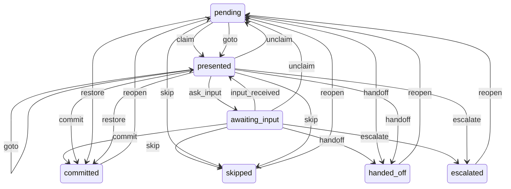

# Assist step state machine (§17.1074)

Declared once in `app/modules/assist_step_fsm.py` (`transitions`); the write sites that have
re-broken the mirror invariant (§17.878/880/911/1054) call `check(site, src=, dst=, node_status=,
trigger=)` before writing. Log-only by default (`step_fsm_violation`); `assist_step_fsm_strict`
raises. `tests/test_assist_step_fsm.py` inventories every SQL `status = '…'` write on
`assist_steps` / `dag_nodes` by AST and asserts the target is a declared state.

| step status | node status it must mirror |
|---|---|
| pending / presented / awaiting_input | pending |
| committed | done |
| skipped | skipped |
| handed_off | pending, running, done, failed |
| escalated | pending, failed |

`pending → committed` is legal only as `restore` (undo a reopen from its §17.1056 pre-image);
as `commit` it is the §17.878 commit-without-claim shape and the oracle refuses it.
